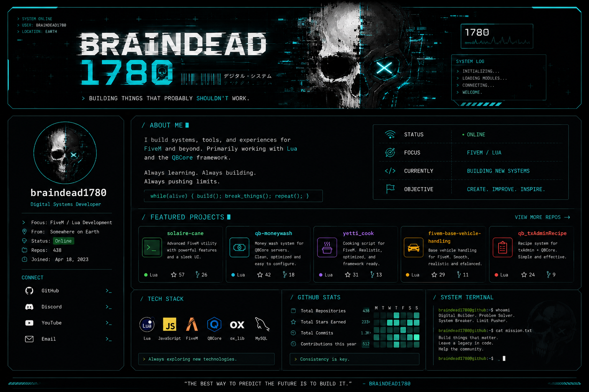

<div align="center">



<br>

### `DIGITAL SYSTEMS // FIVE M // LUA`

> **building things that probably shouldn't work.**

<br>

[](https://github.com/braindead1780)
[](#)
[](#)
[](#)

</div>

---

## `// ABOUT`

```text
USER        : BRAiNDEAD1780
FOCUS       : FIVE M / LUA DEVELOPMENT
FRAMEWORK   : QBOX
ECOSYSTEM   : OX
STATUS      : BUILDING
OBJECTIVE   : CREATE. IMPROVE. EXPERIMENT.
```

I build scripts, systems and tools for **FiveM**, primarily working with **Lua**, **QBox** and the wider **Overextended / ox ecosystem**.

A lot of the work here is experimentation — taking an idea, breaking it, rebuilding it, and seeing how far it can go.

```lua
while alive do
    build()
    break_things()
    learn()
    repeat()
end
```

---

## `// CURRENT SYSTEM`

| MODULE       | STATUS       |
| :----------- | :----------- |
| `FiveM`      | `ONLINE`     |
| `Lua`        | `ONLINE`     |
| `QBox`       | `ACTIVE`     |
| `qbx_core`   | `ACTIVE`     |
| `ox_lib`     | `ACTIVE`     |
| `JavaScript` | `EXPLORING`  |
| `NUI`        | `ACTIVE`     |
| `New Ideas`  | `LOADING...` |

---

## `// FEATURED PROJECTS`

### `01` — SOLAIRE-CANE

**FiveM / Lua**

A FiveM project representing my own development work.

`Lua` · `FiveM` · `QBox`

> **Status:** `ACTIVE`

---

### `02` — MORE INCOMING

I'm currently going through my repositories and separating **my own work** from experiments, forks and archived projects.

The goal:

> **less noise. better projects.**

More projects will appear here as they become worth showcasing.

---

## `// STACK`

<div align="center">

| CORE       | FRAMEWORK | ECOSYSTEM    |
| :--------- | :-------- | :----------- |
| Lua        | QBox      | ox_lib       |
| JavaScript | qbx_core  | oxmysql      |
| TypeScript | FiveM     | ox_target    |
| HTML / CSS | NUI       | ox_inventory |

</div>

---

## `// WHAT I LIKE BUILDING`

```text
┌──────────────────────────────────────────────────────────┐
│                                                          │
│   GAMEPLAY SYSTEMS                                       │
│   ├── mechanics                                           │
│   ├── interactions                                        │
│   └── player systems                                     │
│                                                          │
│   FIVE M RESOURCES                                        │
│   ├── QBox / qbx_core                                    │
│   ├── ox ecosystem                                       │
│   └── custom integrations                                │
│                                                          │
│   EXPERIMENTAL PROJECTS                                   │
│   ├── ideas                                               │
│   ├── tools                                               │
│   └── things that probably shouldn't work               │
│                                                          │
└──────────────────────────────────────────────────────────┘
```

---

## `// SYSTEM LOG`

```text
[ 21:30 ] boot sequence initiated
[ 21:31 ] loading Lua environment...
[ 21:32 ] FiveM modules loaded
[ 21:33 ] QBox environment detected
[ 21:34 ] idea detected
[ 21:35 ] questionable implementation started
[ 21:36 ] back to work
```

---

## `// PHILOSOPHY`

> **Build it. Break it. Fix it. Make it better.**

I don't need every project to be perfect.

I care more about **learning, experimenting and making the next thing better than the last.**

---

<div align="center">

### `BRAiNDEAD1780`

`SYSTEM ONLINE // KEEP BUILDING`

<br>


</div>
